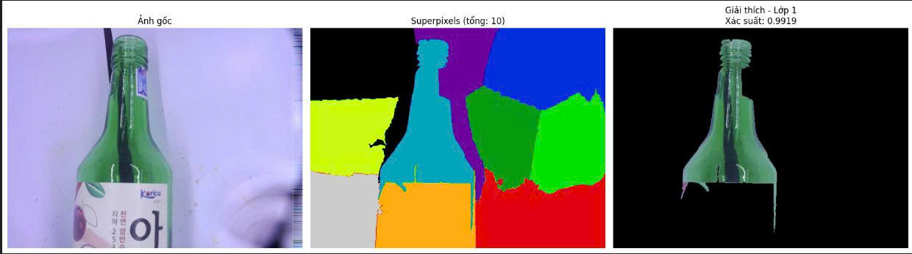
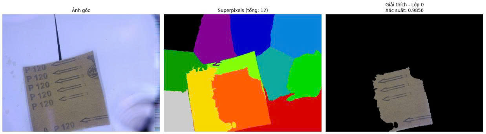
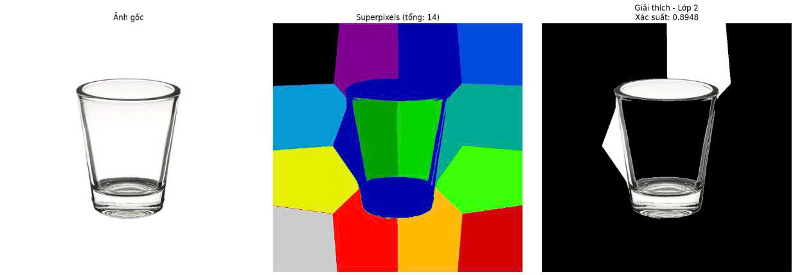
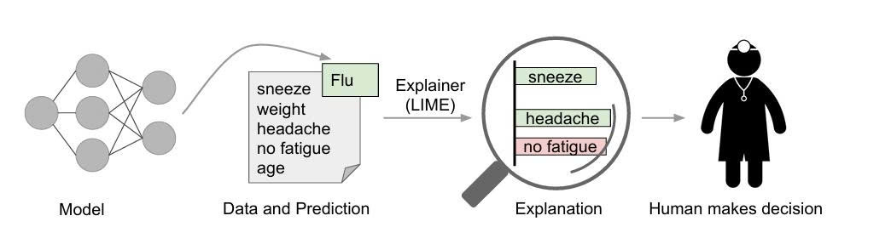

# Explanation and interpretation of the black box model for trash classification using LIME
Một triển khai đầy đủ của thuật toán LIME (Local Interpretable Model-agnostic Explanations) cho bài toán phân loại ảnh rác thải, sử dụng mobilenet_v3_small làm mô hình hộp đen và Ridge Regression làm mô hình giải thích cục bộ.  
Mô hình phân loại 6 lại rác thải: 
1. cardboard  
2. glass  
3. metal  
4. paper  
5. plastic  
6. trash  

# 🎯 Giới thiệu  
Mặc dù các mô hình deep learning đạt độ chính xác cao, chúng thường hoạt động như "hộp đen" - khó hiểu được lý do đưa ra dự đoán. LIME giải quyết vấn đề này bằng cách:  
+ ✅ Giải thích bất kỳ mô hình phân loại ảnh nào (model-agnostic).    
+ ✅ Tạo giải thích cục bộ xung quanh mỗi dự đoán.  
+ ✅ Sử dụng mô hình đơn giản (Linear Regression) để con người hiểu được.   
+ ✅ Highlight các vùng quan trọng trên ảnh.  

Bài báo gốc: "Why Should I Trust You?" Explaining the Predictions of Any Classifier
Marco Tulio Ribeiro, Sameer Singh, Carlos Guestrin
KDD 2016  
Link bài báo: https://arxiv.org/abs/1602.04938   

# 🔬 Cơ chế hoạt động  
LIME hoạt động qua 4 bước chính:  
+ 1️⃣ Chuyển đổi sang biểu diễn dữ liệu có thể giải thích (Interpretable Representation).  
+ 2️⃣ Lấy mẫu và tạo dữ liệu biến đổi (Sampling for Local Exploration).  
+ 3️⃣ Gán trọng số theo độ tương đồng cục bộ (Weighting by Proximity).  
+ 4️⃣ Huấn luyện mô hình giải thích cục bộ (Learning a Local Model).  

# 📦 Cài đặt  
+ torch>=1.7.0  
+ torchvision>=0.8.0  
+ numpy>=1.19.0  
+ scikit-learn>=0.24.0  
+ scikit-image>=0.18.0  
+ matplotlib>=3.3.0  
+ Pillow>=8.0.0  
+ requests>=2.25.0  

# ⚙️ Tham số  
+ image_path: Đường dẫn hoặc URL đến ảnh.  
+ model_path: Đường dẫn trọng số mô hình.  
+ target_class: Lớp cần giải thích (None = lớp được dự đoán).  
+ num_samples: Số mẫu biến đổi để tạo (100-5000).  
+ num_features: Số superpixels quan trọng nhất (1-50).  
+ n_segments: Số lượng superpixels (50-300).  
+ compactness: Độ đồng đều của superpixels.  
+ positive_only: Chỉ hiện superpixels đóng góp tích cực.  

# Mô hình phân lại rác thải
Lấy trọng số mô hình ngay tại đây: checkpoints/best_model_finetune.pth  

